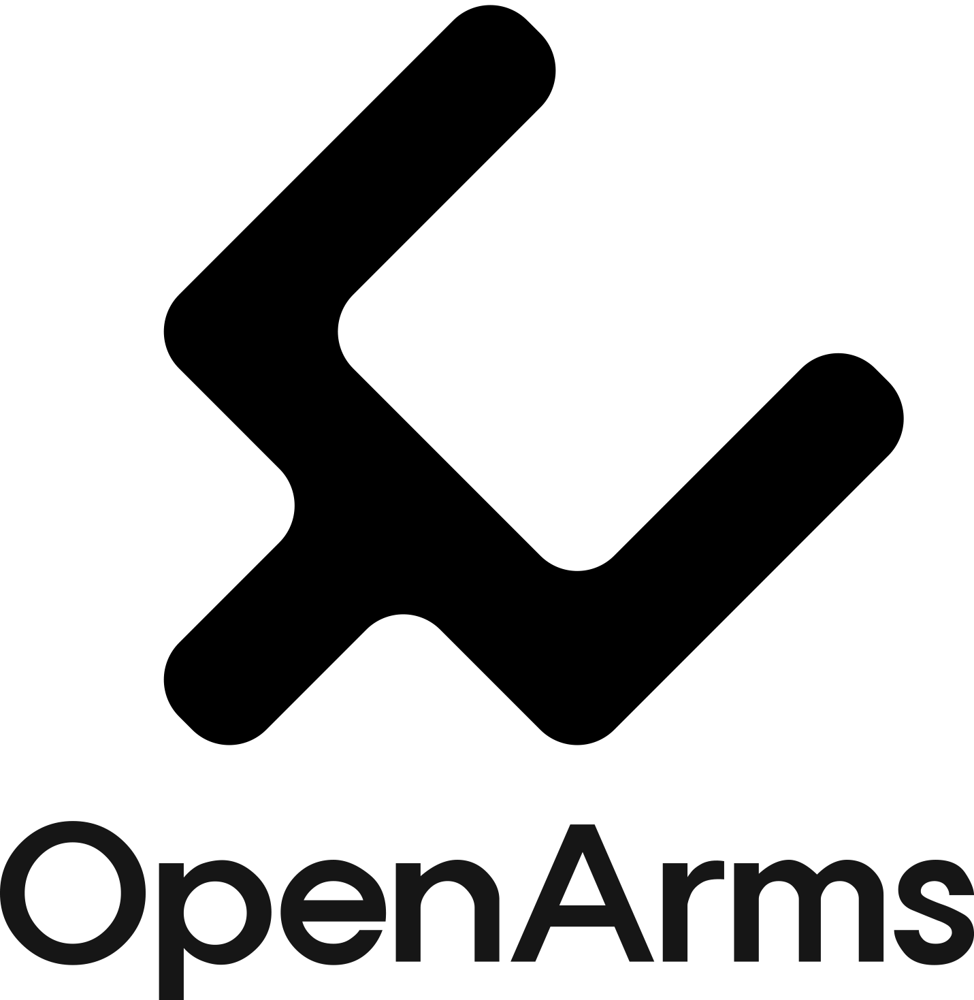
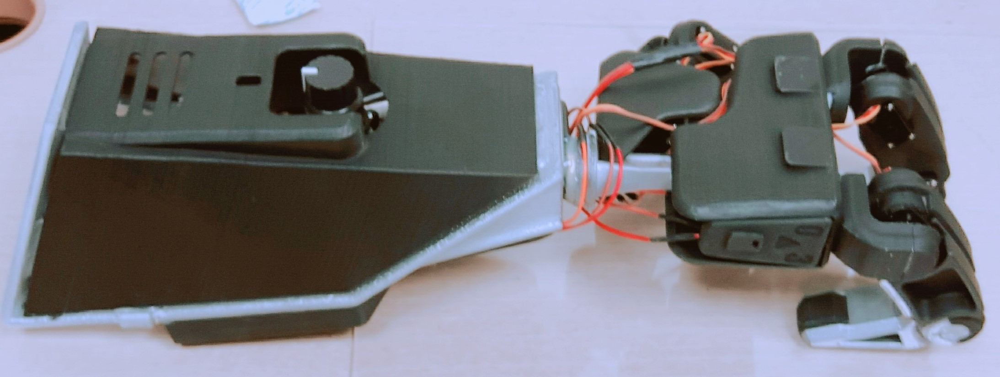
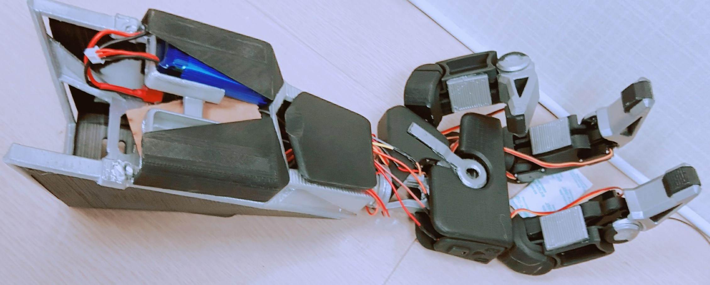
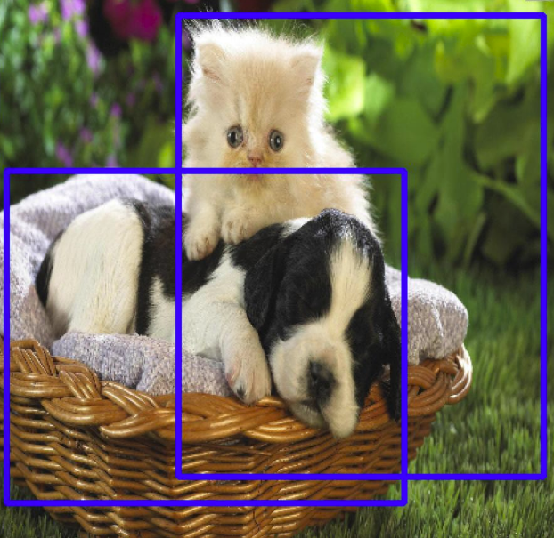

# OpenArms_Research_Project








**OPENARMS MK.2**

This product has a tiny camera in the center of the palm.
The camera's purpose is that recognize object and grab it which already defined optimized movement.
We received a 2nd award at 2017 Wearable Computer Contest (WCC) hosted by KAIST.

## Requirements

#### Hardware
* Raspberry Pi 3  (Ubuntu Mate 16.04)
* Arduino nano  (Arduino Uno also fine)
* Adafruit 16-Channel 12-bit PWM/Servo Driver - I2C interface - PCA9685
* Servo Motor (Gotech-SER0011 x **9ea**)
* Li-Po Battery 2 cells(7.4V) 1300mAh
* spy camera for Pi
* Rotary Switch (DFRobot-SEN0156)

#### Software
* Opencv >= 3.2.0 (Add **enable gstreamer** option when you build it.)
* Tensorflow >= 1.1.0
* Keras >= 2.0.8
* ROS kinetic
* rosserial_arduino (arduino ros module)
* Adafruit-PWM-Servo-Driver-Library (<https://github.com/adafruit/Adafruit-PWM-Servo-Driver-Library>)

## Components
| Sources                   | Explanation                                          |
| ------------------------- | ---------------------------------------------------- |
| arduino/                  | Arduino code directory.                              |
| rospy/openarms_percepton/ | detection package with model and pretrained weights. |

## Installation
Step 1 : Copy openarms_perception package in rospy directory to your catkin workspace src directory.

Step 2 : Upload `openarms_control.ino` code to your Arduino.

*Please contact to design head if you need prosthetic arm design assets.*

## Quick Start
Step 1 : Execute roscore.
```
roscore
```
Step 2 : Launch ros module.
```
roslaunch openarms_perception detection.launch
```
After 1-2 minutes, ready message are going to print out on your screen.

Step 3 : Start ros serial communication!
```
rosrun rosserial_python serial_node.py /port/you/connected
```
Default setting of port/you/connected might be /dev/ttyUSB0.
```
rosrun rosserial_python serial_node.py /dev/ttyUSB0
```

## Detection Model
Our approach is using deep learning so we chose **Tiny Yolo** which has lighter and faster than any other yolo model.

#### Detection
* We use [tiny yolo](https://pjreddie.com/darknet/yolo/) trained by [ms coco](https://pjreddie.com/darknet/yolo/) dataset.
* Model is for Keras framework. (backend tensorflow)
* Detection procedure takes about **2.7 seconds**. 

#### Why Tiny Yolo?

- RAM size of Raspberry Pi3 is only 1 GB.

- We need fastest detection model.

  

Weights are transformed from [official site](https://pjreddie.com/darknet/yolo/) of yolo.

| Model     | mAP  | FLOPS  | keras_weights |
|-----------|------|--------|-----------------|
| Tiny YOLO | 23.7 | 5.41 Bn | [weights](./ROS_module/openarms/src/model_data/yolo-coco.h5)

## Contact to Team LIMB
Anthony Kim : artit.anthony@gmail.com - Perception Lead

Ethan Kim : 4artit@gmail.com - Team Leader

WonJae Ji : jiwi1005@gmail.com(Head of Design)
