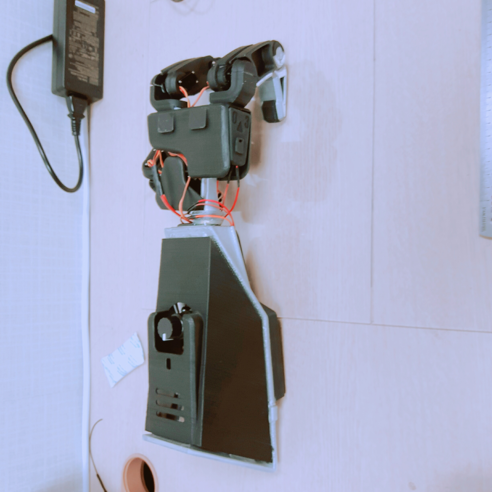

# OpenArms_Research_Project
This is about OpenArms MK.2(Prosthetic Arm).

We put cameras in the middle of the palm of existing OpenArms MK.2.

And made it possible to perform different actions according to the object through real-time object recognition.

We received a excellence award with this project at the Wearable Computer Contest (WCC) hosted by KAIST.




## Requirements
#### Hardware
* Raspberry pi 3  (with **Ubuntu Mate 16.04** )
* Arduino nano  (Can use Arduino Uno)
* Adafruit 16-Channel 12-bit PWM/Servo Driver - I2C interface - PCA9685
* Servo Motor (Gotech-SER0011 x 9ea)
* Li-Po Battery 2 cells(7.4V) 1300mAh
* spycam for Pi
* Rotary Switch (DFRobot-SEN0156)

#### Software
* Opencv >= 3.2.0 
* Tensorflow >= 1.1.0
* Keras >= 2.0.8
* ROS kinetic
* rosserial_arduino (arduino ros module)
* Adafruit-PWM-Servo-Driver-Library (<https://github.com/adafruit/Adafruit-PWM-Servo-Driver-Library>)

You should **enable gstreamer** when you build **opencv**!!

## Components
| Sources               |  Explanation                                            |
|-----------------------|---------------------------------------------------------|
| Arduino_code          | Arduino code directory.                                 |
| ROS_modeule/          | Folder contains tiny yolo model and pretrained weights. |

## Installation
Step 1 : Copy openarms folder in ROS_module folder to your catkin workspace.

Step 2 : Upload Arduino code to your Arduino.

That's all !!

## Quick Start
Step 1 : Execute roscore.
```
roscore
```
Step 2 : Launch ros module.
```
roslaunch openarms detection.launch
```
After 1-2 minutes, ready message will out on your screen.

Step 3 : Start ros serial communication!
```
rosrun rosserial_python serial_node.py /port/you/connected
```
Default setting of port/you/connected is maybe /dev/ttyUSB0.
```
rosrun rosserial_python serial_node.py /dev/ttyUSB0
```

## Details
All codes are made by ourselves.

#### detection
* We use [tiny yolo](https://pjreddie.com/darknet/yolo/) trained with [ms coco](https://pjreddie.com/darknet/yolo/).
* We made model with Keras. (backend tensorflow)
* Detection procedure takes only **2.7 seconds**. 
 
Of course, there are more accurate models. 

But, we have only 1 GB ram on raspberry pi even without gpu.

Tiny yolo was the best choice.


Weights are transformed from [official site](https://pjreddie.com/darknet/yolo/) of yolo.

| Model     | mAP  | FLOPS  | keras_weights |
|-----------|------|--------|-----------------|
| Tiny YOLO | 57.1 | 6.97bn | [weights](./ROS_module/openarms/src/model_data/yolo-coco.h5)

## Next
We'll make more advanced version prosthetic arm.

It'll contain 
* Dry electromyography sensor. 
* Embedded board with GPU. (maybe nvidia [tx2](https://developer.nvidia.com/embedded/buy/jetson-tx2) board).
* More powerful detection model. (maybe [RetinaNet](https://arxiv.org/abs/1708.02002))
* Optimized model. (like [quantization](https://www.tensorflow.org/performance/quantization))

## Contact to ARTIT!
Any questions about our project are welcome!!

Please contact us!

Anthony Kim : artit.anthony@gmail.com

Ethan Kim : 4artit@gmail.com

WonJae Ji : jiwi1005@gmail.com(if you want to ask about design contact him.)


## GNU General Public License v3.0
Get more information about [license](https://github.com/ARTITLABS/OpenArms_Research_Project/blob/master/LICENSE)
